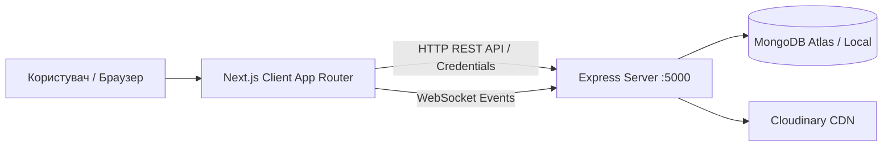

# Luhansk Library — Client Module (Next.js Application)

Фронтенд-частина веб-порталу Луганської обласної універсальної наукової бібліотеки. Додаток побудований на **Next.js 16 (App Router)** із суворим дотриманням **Client-Server архітектури** та повної типізації **TypeScript**.

---

## 🏗 Архітектура та Декаплінг (Decoupling)

Фронтенд працює **виключно через HTTP API (REST) та WebSockets (Socket.io)** з бекенд-сервером Express (`server`). 
Клієнтський модуль **не містить прямих підключень до бази даних** (MongoDB/Mongoose), не виконує прямої роботи з драйверами БД і не використовує локальні серверні маршрути для роботи з даними.



---

## 🛠 Технологічний Стек

- **Фреймворк:** Next.js `v16.2.4` (App Router) + React `v19.2.5`
- **Мова:** TypeScript `v5.x`
- **Стейт-менеджмент:** Redux Toolkit `v2.11.0` + RTK Query (`@reduxjs/toolkit/query/react`)
- **Стилізація:** SCSS / Sass Modules (`*.module.scss`) `v1.89.2`
- **Анімації:** GSAP (GreenSock Animation Platform) `v3.14.2`
- **Real-time зв'язок:** Socket.io-client `v4.8.1`
- **Парсинг архівного вмісту:** `html-react-parser` `v5.2.10`

---

## ⚙️ Змінні оточення (Environment Variables)

Для роботи додатку необхідно створити файл `.env.local` у корені папки `client`:

```env
# URL нашого Express бекенду
NEXT_PUBLIC_API_URL=http://localhost:5000

# Початковий URL публічного сайту (для метатегів та SEO)
PUBLIC_SITE_URL=http://localhost:3000
```

---

## 🚀 Скрипти запуску

Здійснюйте запуск команд з папки `client`:

- **Режим розробки:**
  ```bash
  npm run dev
  ```
  Додаток доступний за адресою `http://localhost:3000`.

- **Збірка для продакшену:**
  ```bash
  npm run build
  ```

- **Запуск зібраного продакшен-сервера:**
  ```bash
  npm run start
  ```

- **Перевірка коду (Лінтер):**
  ```bash
  npm run lint
  ```

---

## 📂 Структура каталогу `client/src`

- **`app/`** — Маршрутизація Next.js App Router (Route groups: `(website)`, `admin`, `register`, dynamic routes).
- **`components/`** — Реутилізовні UI-компоненти (Header, Footer, PostList, SingleOldPost, Auth, Admin, Preloader, SafeHTML).
- **`config/`** — Константи, шляхи медіафайлів (Cloudinary CDN), меню сайту.
- **`context/`** — React Context (ThemeContext для перемикання світлої/темної теми).
- **`hooks/`** — Кастомні React-хуки (`useTheme`, `useWindowWidth`).
- **`lib/`** — Налаштування Redux Store, RTK Query (`postsApi`), HTTP-хелпери (`api.ts`), Socket.io клієнт (`socket.ts`).
- **`types/`** — Модулі типізації TypeScript (`post.types.ts`, `user.types.ts`, `layout.types.ts`, `theme.types.ts`).
- **`utils/`** — Утиліти форматування та обробки даних (`fixLegacyContent.ts`).
