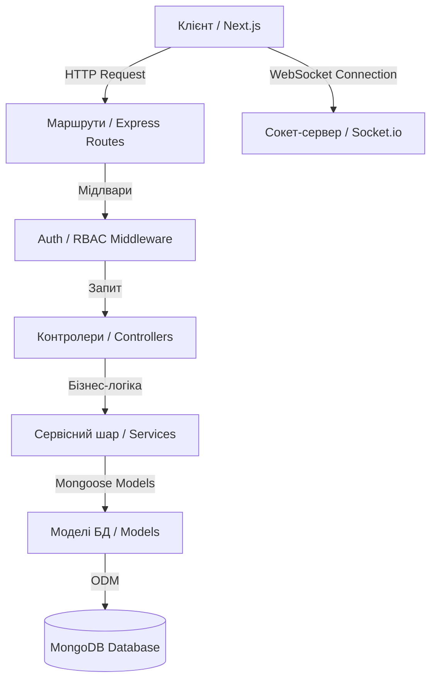

# Серверний модуль бібліотеки (`server`)

Даний каталог містить бекенд-частину (REST API та WebSockets) веб-сайту бібліотеки. Сервер побудований на Node.js із використанням TypeScript, Express 5, Mongoose та Socket.io.

---

## 🏗️ 1. Опис архітектури бекенду

Архітектура сервера побудована за модульним принципом з чітким розділенням відповідальностей (Separation of Concerns):



### Ключові шари системи:
- **Маршрутизація (`src/routes`)**: Приймає HTTP-запити та спрямовує їх до відповідних контролерів і мідлвар.
- **Мідлвари (`src/middleware`)**: Перехоплюють запити, виконують перевірку JWT-токена у куках та контролюють доступ за ролями (`user`, `manager`, `admin`).
- **Контролери (`src/controllers`)**: Обробляють HTTP-запити, зчитують параметри, викликають сервіси/моделі та повертають відповіді у JSON-форматі.
- **Сервіси (`src/services`)**: Містять бізнес-логіку (хешування паролів `bcrypt`, випуск та верифікація JWT-токенів).
- **Моделі даних (`src/models`)**: Описують Mongoose-схеми та взаємодіють із колекціями MongoDB.
- **Типи (`src/types`)**: Інтерфейси TypeScript для забезпечення суворої типізації даних у всьому проєкті.
- **Скрипти (`src/scripts`)**: Інструменти для парсингу, завантаження медіа у Cloudinary та міграції архівних даних.
- **WebSockets (`src/socket`)**: Модуль для підтримки двостороннього зв'язку в реальному часі.

---

## 🛠️ 2. Використані технології

Перелік основних бібліотек та інструментів (згідно з [`package.json`](/server/package.json)):

### Основний стек (Dependencies):
- **[Express v5.1.0](https://expressjs.com/)**: Фреймворк для побудови REST API (версія 5 з автоматичною обробкою асинхронних помилок).
- **[Mongoose v9.0.0](https://mongoosejs.com/)**: ODM для зручної роботи з MongoDB.
- **[Socket.io v4.8.1](https://socket.io/)**: Бібліотека для реалізації WebSockets (реальний час).
- **[Bcryptjs v3.0.3](https://github.com/dcodeIO/bcrypt.js)**: Хешування паролів користувачів перед збереженням у БД.
- **[Jsonwebtoken v9.0.3](https://jwt.io/)**: Випуск та перевірка JWT-токенів для авторизації.
- **[Cookie-parser v1.4.7](https://github.com/expressjs/cookie-parser)**: Парсинг куків запиту для зчитування токенів сесії.
- **[Cors v2.8.5](https://github.com/expressjs/cors)**: Налаштування Cross-Origin Resource Sharing.
- **[Multer v2.0.2](https://github.com/expressjs/multer)** & **[Cloudinary v2.8.0](https://cloudinary.com/)**: Обробка та завантаження медіафайлів/документів у хмару.
- **[Dotenv v17.2.3](https://github.com/motdotla/dotenv)**: Завантаження змінних оточення з файлу `.env`.

### Інструменти розробки (DevDependencies):
- **TypeScript v5.9.3**: Сувора типізація коду.
- **Nodemon v3.1.11** & **ts-node v10.9.2**: Автоматичний перезапуск сервера під час розробки.
- **Jest v30.2.0** & **Supertest v7.1.4**: Модульне та інтеграційне тестування API.

---

## 🔑 3. Змінні оточення (`.env`)

Для повноцінної роботи сервера необхідно створити файл `.env` у каталозі `server/` з такими змінними:

| Змінна | Обов'язкова | Значення за замовчуванням | Опис |
| :--- | :---: | :--- | :--- |
| `PORT` | Ні | `5000` | Порт, на якому запускається HTTP-сервер |
| `MONGO_URI` | **Так** | `mongodb://127.0.0.1:27017/luhansk-library` | Рядок підключення до MongoDB (Atlas або локальна БД) |
| `JWT_SECRET` | **Так** | `'fallback_secret_key'` | Секретний ключ для підпису JWT-токенів |
| `NODE_ENV` | Ні | `'development'` | Режим роботи (`development` або `production`) |
| `CLOUDINARY_CLOUD_NAME` | Для міграцій | — | Назва акаунту в Cloudinary |
| `CLOUDINARY_API_KEY` | Для міграцій | — | API Ключ Cloudinary |
| `CLOUDINARY_API_SECRET` | Для міграцій | — | Секретний API Ключ Cloudinary |

---

## 🚀 4. Інструкції щодо локального запуску

### Крок 1: Встановлення залежностей
Перейдіть у папку `server` та виконайте команду:
```bash
npm install
```

### Крок 2: Налаштування змінних оточення
Створіть файл `.env` у папеці `server/` та вкажіть параметри підключення:
```env
PORT=5000
MONGO_URI=mongodb://127.0.0.1:27017/luhansk-library
JWT_SECRET=super_secret_jwt_key_12345
NODE_ENV=development
```

### Крок 3: Запуск сервера у режимі розробки
Для запуску сервера з гарячим перезавантаженням (`nodemon` + `ts-node`):
```bash
npm run dev
```
Після успішного запуску ви побачите у консолі:
```text
🔄 Підключення до MongoDB (база: luhansk_library)...
✅ Успішно підключено до MongoDB (luhansk_library)!
🚀 Сервер запущений на порту 5000
```

### Крок 4: Запуск тестів
Для виконання автотестів (Jest + Supertest):
```bash
npm run test
```

---

## 🌐 5. Особливості деплою на Vercel (Serverless Functions)

Для розгортання бекенду на Vercel створено точку входу [**`api/index.ts`**](/server/api/index.ts) та налаштовано перенаправлення запитів у [**`vercel.json`**](/server/vercel.json) (`rewrites` до `/api`).

**Основні моменти:**
1. **Точка входу Vercel**: `api/index.ts` перенаправляє всі HTTP-запити до Express-хендлера з `src/index.ts`.
2. **Кешування з'єднання БД**: З'єднання з MongoDB повторно використовується між Serverless-інвокаціями.
3. **MongoDB Atlas Whitelist**: `0.0.0.0/0` додано в **Network Access** у MongoDB Atlas.
4. **CORS**: Налаштовано `cors({ origin: true, credentials: true })` для підтримки крос-доменних запитів з фронтенду Next.js.
5. **Змінні оточення Vercel**: У налаштуваннях проєкту `server` на Vercel необхідно додати `MONGO_URI` та `JWT_SECRET`.

---

## 📂 6. Структура підкаталогів `src/` та їх документація

Детальний опис кожного модуля бекенду доступний у відповідних документах:

- 📑 [**`src/models/README.md`**](/server/src/models/README.md) — Опис Mongoose-схем (`Post`, `User`), полів та валідацій.
- 📑 [**`src/types/README.md`**](/server/src/types/README.md) — Опис TypeScript-інтерфейсів (`IPost`, `IUser`, `UserRole`).
- 📑 [**`src/controllers/README.md`**](/server/src/controllers/README.md) — Опис функцій обробки HTTP-запитів (`auth`, `post`, `user`).
- 📑 [**`src/routes/README.md`**](/server/src/routes/README.md) — Зведена таблиці API-ендпоінтів та підключених методів.
- 📑 [**`src/middleware/README.md`**](/server/src/middleware/README.md) — Логіка перехоплення запитів (`authMiddleware`, `optionalAuthMiddleware`, `requireAdmin`).
- 📑 [**`src/services/README.md`**](/server/src/services/README.md) — Бізнес-логіка автентифікації та випуску токенів (`AuthService`).
- 📑 [**`src/scripts/README.md`**](/server/src/scripts/README.md) — Скрипти імпорту даних, завантаження у Cloudinary та генерації карт.
- 📑 [**`src/socket/README.md`**](/server/src/socket/README.md) — Логіка ініціалізації WebSockets через Socket.io.
